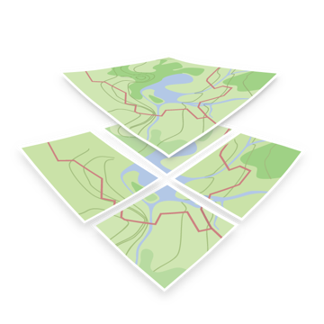

# Cross-Platform Maps App



Cross-Platform Maps App using [React Native](https://github.com/facebook/react-native) with [Mapbox GL Module](https://github.com/mapbox/react-native-mapbox-gl) and [OSM2VectorTiles](http://osm2vectortiles.org/) as vector data source.

## Install

In order to build the Android or iOS version you need to install Xcode and Android Studio.

**Dependencies**
* [node](https://nodejs.org/en/download/)
* [npm](https://docs.npmjs.com/getting-started/installing-node)
* [React Native](https://facebook.github.io/react-native/) >= 0.15.0
* [Mapbox GL Module](https://github.com/mapbox/react-native-mapbox-gl)
* [Xcode](https://developer.apple.com/xcode/download/)
* [Android Studio](http://developer.android.com/sdk/index.html)

After cloning this repository add your [Mapbox API Access Token](https://www.mapbox.com/help/create-api-access-token/) to the `index.ios.js` and `index.android.js` file. The API is still needed for sprites and glyphs even though OSM2VectorTiles is used as vectortile source.

```bash
npm install
react-native run-android OR react-native run-ios
```

More information about getting started with React Native can be found [here](https://facebook.github.io/react-native/docs/getting-started.html).


